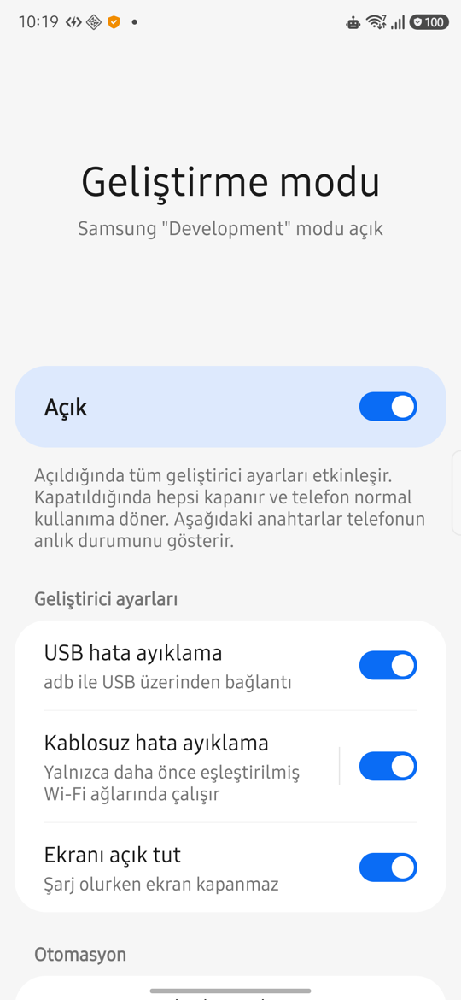

<p align="center">
  
</p>

<h1 align="center">DevMode Helper</h1>

<p align="center">
  Tek dokunuşla Android geliştirme modu: USB/kablosuz hata ayıklama ve "ekranı açık tut" birlikte açılır,
  kapatınca hepsi kapanır. Samsung <b>Modlar ve Rutinler</b> ile otomatik çalışır.
</p>

<p align="center"><a href="#english">English summary below</a></p>

---

Telefonda uygulama test ederken (ör. bir yapay zekâ ajanına adb üzerinden test yaptırırken) ekranın kapanıp
kilitlenmesi, her seferinde USB/kablosuz hata ayıklamayı ve Samsung **Auto Blocker**'ı elle açıp kapatmak
yorucu. Güvenlik için bunların normal kullanımda kapalı olması da gerekiyor. DevMode Helper bu ikisini
birleştirir: geliştirme sırasında her şey açık, bitince her şey kapalı.

<p align="center">
  
</p>

## Özellikler

- **Tek ana anahtar**: USB hata ayıklama, kablosuz hata ayıklama ve "ekranı açık tut" (şarjdayken)
  birlikte açılır/kapanır. Her biri ayrıca tek tek açılıp kapatılabilir.
- **Samsung modu ile eşitleme**: Modlar ve Rutinler'de oluşturduğun mod (varsayılan adı `Development`,
  uygulamadan değiştirilebilir) açılınca ayarlar açılır, mod kapanınca hepsi kapanır.
- **Canlı durum**: Ekranda görünen her değer telefonun kendi ayarlarından o an okunur; uygulama kendi
  "açık mı" bilgisini saklamaz. Ayarı sistemden değiştirsen de ekran güncellenir.
- **Auto Blocker farkındalığı**: Auto Blocker açıkken Samsung hata ayıklamayı kapatır; uygulama bunu algılar,
  ilgili anahtarları kilitler ve Samsung'un Auto Blocker ekranını açar. Auto Blocker'ı kapattığında bekleyen
  ayarlar otomatik açılır. Mod kapanınca Auto Blocker'ı yeniden açman için bildirim gösterir.
- **Kalıcı durum bildirimi**: Geliştirici ayarlarından biri açıkken kaldırılamayan bir bildirim durur;
  dokununca uygulama açılır, "Kapat" düğmesi hepsini kapatır.
- **Kablosuz hata ayıklama sayfası**: IP adresi ve bağlantı noktası (telefonun kendi adb mDNS duyurusundan),
  kopyalanabilir `adb connect` komutu, eşleştirme için sistem ekranına kısayol.
- **"Test uygulamaları" widget'ı**: adb (USB/Wi‑Fi) ile yüklediğin uygulamaları ikonlarıyla listeler;
  dokununca açılır. Android belirli bir ana ekran sayfasına ikon koymaya izin vermediği için widget'ı bir kez
  istediğin sayfaya (ör. 3. sayfa) koyarsın, yeni kurulan uygulamalar orada görünür.
- One UI ayar ekranı görünümü (anahtar ölçü ve renkleri Samsung'un kendi kaynaklarından), açık/koyu tema,
  tematik ikon desteği.

## Gereksinimler

- Android 14 veya üstü (minSdk 34). Samsung One UI 8.5 / Android 16 üzerinde test edildi.
- Samsung dışı cihazlarda ana anahtar ve tek tek anahtarlar çalışır; mod eşitleme ve Auto Blocker
  özellikleri Samsung'a özeldir.
- Kurulum için bir kez bilgisayar ve [Android SDK Platform-Tools](https://developer.android.com/tools/releases/platform-tools) (`adb`).

## Kurulum

1. APK'yı edin:
   - Kendin derle (aşağıya bak) **veya**
   - Repodaki GitHub Actions çalıştırmalarından `devmode-helper-apk` dosyasını indir.
     (Her CI çalıştırması farklı bir anahtarla imzalanır; sonraki bir sürümü kurarken önce eskisini kaldırman
     gerekebilir.)
2. Telefonda USB hata ayıklamayı bir kereliğine aç ve kur:
   ```bash
   adb install devmode-helper.apk
   ```
3. Ayar yazma iznini ver (sadece adb ile verilebilen bir izindir):
   ```bash
   adb shell pm grant works.mora.devmode android.permission.WRITE_SECURE_SETTINGS
   ```
4. Uygulamayı bir kez aç, bildirim iznine **İzin ver** de.
5. Ayarlar › Uygulamalar › DevMode Helper › Pil › **Kısıtlanmamış** seç (arka plandaki tetikleme gecikmesin).
6. (Samsung) Modlar ve Rutinler'de bir mod oluştur, adını uygulamadaki "İzlenen Samsung modu" ile aynı yap.
   Ekran zaman aşımı gibi Samsung'un kendi desteklediği ayarları modun içine ekleyebilirsin.

## Test uygulamaları widget'ı

1. Uygulamada **Ana ekran › Test uygulamaları widget'ı**'na dokun ve widget'ı ekle
   (ya da ana ekrana uzun bas › Widget'lar › DevMode Helper).
2. Widget'ı istediğin sayfaya taşı.
3. adb ile kurulan uygulamalar otomatik listelenir. Liste başlıktaki yenile düğmesiyle, 15 dakikada bir,
   DevMode Helper açıldığında ya da bilgisayardan şu komutla yenilenir:
   ```bash
   adb shell am broadcast -n works.mora.devmode/.DevAppsWidget -a works.mora.devmode.REFRESH_DEV_APPS
   ```

> **`adb: more than one device/emulator` hatası:** Telefon hem USB hem kablosuz hata ayıklamayla bağlıysa
> adb bunları iki ayrı cihaz görür. Bu README'deki tüm adb komutlarında hangisine gideceğini belirt:
> `adb -d …` USB'deki tek cihaza gönderir, `adb -s <seri> …` belirli bir cihaza gönderir (seri `adb devices`
> listesinde yazar). Sürekli aynı telefonla çalışıyorsan `export ANDROID_SERIAL=<seri>` ile varsayılan cihazı
> ayarlayabilirsin.

adb kurulumu, kurucu paketi olmamasından (`InstallSourceInfo.getInstallingPackageName() == null`) tanınır;
sistem uygulamaları hariçtir. Android 8'den beri "paket eklendi" yayını arka plandaki uygulamalara
iletilmediği için yeni kurulum anında değil, yukarıdaki yenilemelerle görünür.

## Nasıl çalışır

- Samsung, aktif modu `Settings.Global` altındaki `mode_enabled` ve `mode_display_name` anahtarlarına yazar.
  Uygulama bu anahtarlar değişince `JobScheduler` içerik tetiklemesiyle uyanır; arka planda sürekli çalışmaz.
- Açma/kapama `Settings.Global.ADB_ENABLED`, `adb_wifi_enabled` ve `STAY_ON_WHILE_PLUGGED_IN` yazılarak yapılır.
  Kapatırken USB hata ayıklama en son kapanır (bağlı adb oturumu o an kopar).
- **Auto Blocker'ın değeri okunamaz**: Samsung bu anahtarı imza izniyle korur, Android 12+ de normal
  uygulamalara okutmaz. Bu yüzden durum telefonun kendi sinyallerinden çıkarılır:
  hata ayıklama açıksa Auto Blocker kesin kapalıdır; anahtar değiştiğinde gelen sistem bildirimi durumu çevirir.
  Çok hızlı art arda açıp kapatmada bir değişim kaçabilir; hata ayıklama açıldığı anda bilgi kendini düzeltir.
- Samsung, sistemdeki "Kablosuz hata ayıklama" detay sayfasının başka uygulamalardan açılmasına izin
  vermez; bu yüzden uygulamanın kendi detay sayfası vardır. Cihaz eşleştirmeyi yalnızca sistem yapabildiği
  için oradan Geliştirici seçenekleri ekranına gidilir.

## Güvenlik

- `WRITE_SECURE_SETTINGS` güçlü bir izindir; uygulama bunu yalnızca yukarıdaki üç ayar için kullanır.
  Kod açıktır, kendin derleyip kurmanı öneririm. İzni geri almak için:
  ```bash
  adb shell pm revoke works.mora.devmode android.permission.WRITE_SECURE_SETTINGS
  ```
- Uygulama Auto Blocker'ı **değiştirmez**, sadece Samsung'un kendi ekranını açar.
- `INTERNET` izni yalnızca kablosuz hata ayıklama portunu bulmak için vardır: Android, yerel mDNS
  (`NsdManager`) için bu izni şart koşar ve bulunan port telefonun kendi IP'sinde yoklanır.
  Uygulama hiçbir dış sunucuya bağlanmaz, veri toplamaz.
- Dışa açık bileşenler: yalnızca başlatıcı ekranı ve sistemin korumalı açılış yayınlarını alan alıcı.
  Bildirim düğmeleri uygulamanın kendi `PendingIntent`'leriyle çalışır.

## Derleme

Gradle gerekmez; sadece Android SDK (build-tools 36.0.0, platform android-36) ve JDK 17+.

```bash
./build.sh
# çıktı: build/devmode-helper.apk
```

`ANDROID_HOME`, `BUILD_TOOLS`, `KEYSTORE` ortam değişkenleriyle ayarlanabilir. Varsayılan imza anahtarı
`~/.android/debug.keystore`'dur; yoksa oluşturulur.

## Lisans

[MIT](LICENSE)

---

<a id="english"></a>
## English summary

DevMode Helper is a small Android app (UI in Turkish) that turns USB debugging, wireless debugging and
"stay awake while charging" on together with one switch, and turns them all off again for normal, safer use.
On Samsung phones it follows a mode from **Modes and Routines** (default name `Development`) and is aware of
**Auto Blocker**, which Samsung uses to force debugging off. Everything shown is read live from the system
settings; a persistent notification is shown while any developer setting is on.

Setup: build with `./build.sh` (no Gradle), `adb install` the APK, then grant the permission once with
`adb shell pm grant works.mora.devmode android.permission.WRITE_SECURE_SETTINGS`.
Requires Android 14+. Licensed under MIT.
